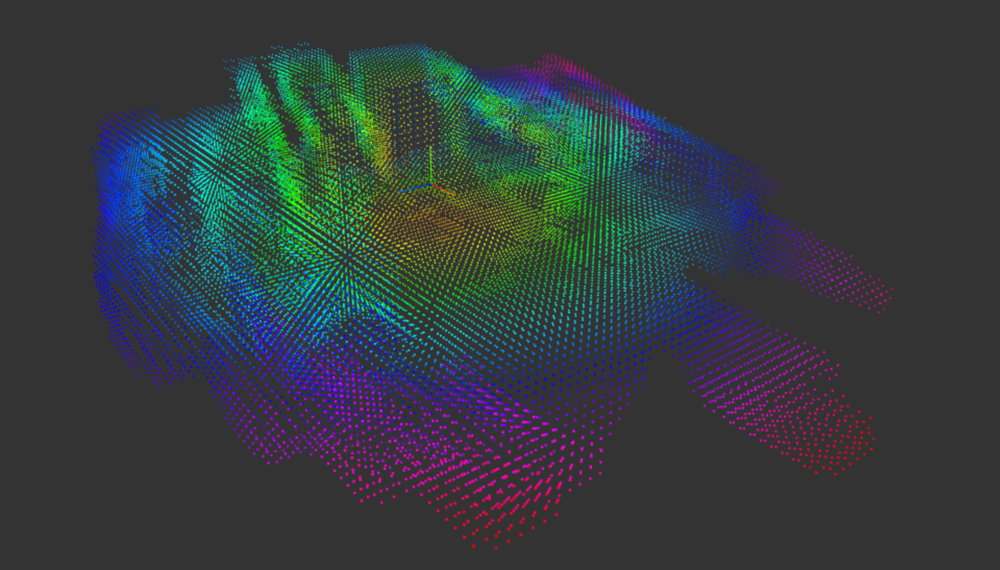
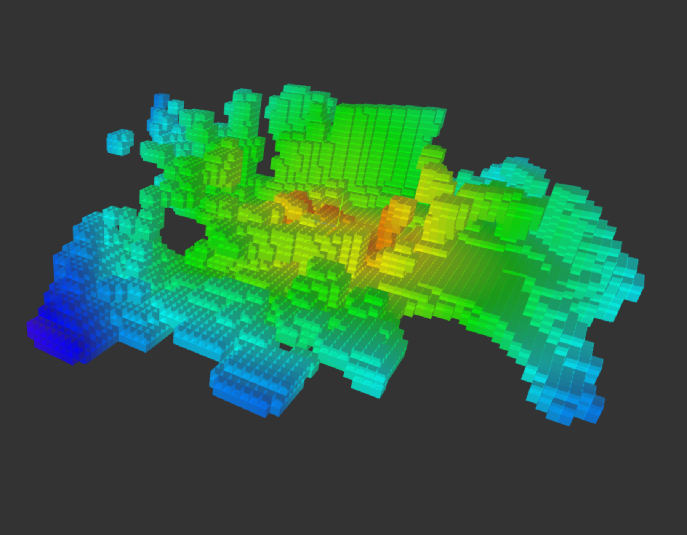

# LiDAR Stream Example (`lidar_stream.py`)

This script processes compressed LiDAR data using two decoders: **libvoxel** and **native**. You can choose the decoder at runtime to suit your application's needs.

## Decoders

### libvoxel Decoder

- **Source:** Derived from the Unitree Go app (WebAssembly-based).
- **Output:**
  ```json
  {
      "point_count": c,
      "face_count": u,
      "positions": p,
      "uvs": r,
      "indices": o
  }
  ```
* Use Case : Voxel map generation and visualization.
* Performance : ~40-50 µs computation time.

### Native Decoder
- **Source** : Python implementation using LZ4 for decompression.
- **Output** :
    ```python
    {
        "points": points(),  # Callable function returning [(x, y, z), ...]
    }
    ```
* Use Case : Raw point cloud extraction for applications like robotics or terrain mapping.
* Perfomance: 20 µs

---
# LiDAR Plot Example (`plot_lidar_stream.py`)




This script visualizes LiDAR data using three.js. View the result at [http://127.0.0.1:8080/](http://127.0.0.1:8080/).

## Usage

Display help:
```bash
python3 plot_lidar_stream.py -h
```

Example command:
```bash
python3 plot_lidar_stream.py --cam-center --type-voxel
```

Options:
```bash
options:
  -h, --help            show this help message and exit
  --version             show program's version number and exit
  --cam-center          Put Camera at the Center
  --type-voxel          Voxel View
  --csv-read CSV_READ   Read from CSV files instead of WebRTC
  --csv-write           Write CSV data file
  --skip-mod SKIP_MOD   Skip messages using modulus (default: 1, no skipping)
  --minYValue MINYVALUE
                        Minimum Y value for the plot
  --maxYValue MAXYVALUE
                        Maximum Y value for the plot

```